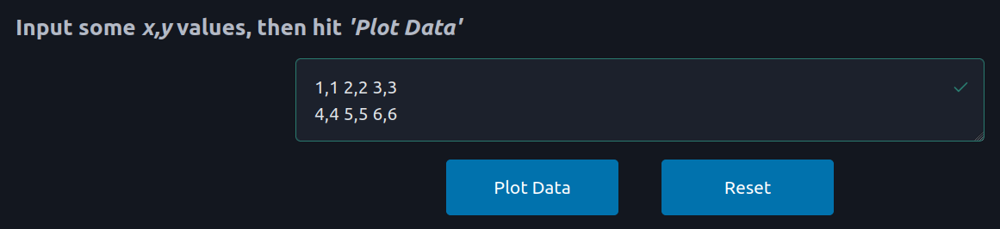
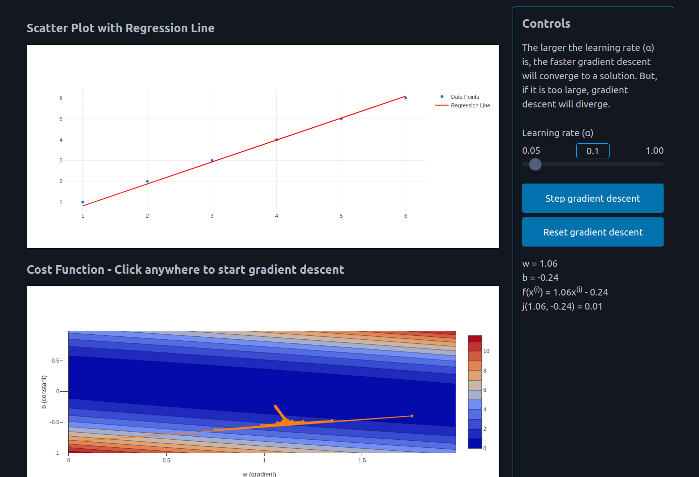

# 📊 Linear Regression Gradient Descent Visualizer

**An interactive web-based tool for visualizing linear regression and gradient descent.**
This project provides an intuitive way to understand how gradient descent optimizes a linear regression model.
Users can input data points, visualize the regression line, and see the gradient descent on the cost function in real time.

## 🚀 Features

- **📌 Interactive Data Input** – Enter data points manually to create a custom dataset.
- **📈 Dynamic Scatter Plot** – See how your data is distributed.
- **📊 3D Cost Function Visualization** – Understand how different `(w, b)` values affect the cost.
- **🔄 Step-by-Step Gradient Descent** – Observe how the model learns and improves iteratively.
- **🎨 Responsive & User-Friendly Interface** – Built with [Plotly.js](https://plotly.com/graphing-libraries/) for interactive graphing.

## 🛠 Installation & Running

1. **Clone the repository**
    ```sh
    git clone https://github.com/yourusername/linear-regression-gradient-descent-visualiser.git
    cd linear-regression-gradient-descent-visualiser
    ```
2. **Run the project**
    ```sh
    go run .
    ```
3. **Open the website**
    - Visit localhost:8080 in your browser.

## 📷 Screenshots

### Input your data to plot


### Perform gradient descent on the resulting cost function


## 🖥 Tech Stack

- **Go** – Backend server with [echo](https://github.com/labstack/echo).
- **HTML, CSS, JavaScript** – Frontend structure and styling with [picocss](https://picocss.com/), and [Plotly.js](https://plotly.com/graphing-libraries/).

## 🤝 Contributing

Contributions are welcome! If you'd like to improve this project:
1. Fork the repository
2. Create a new branch
3. Submit a pull request
